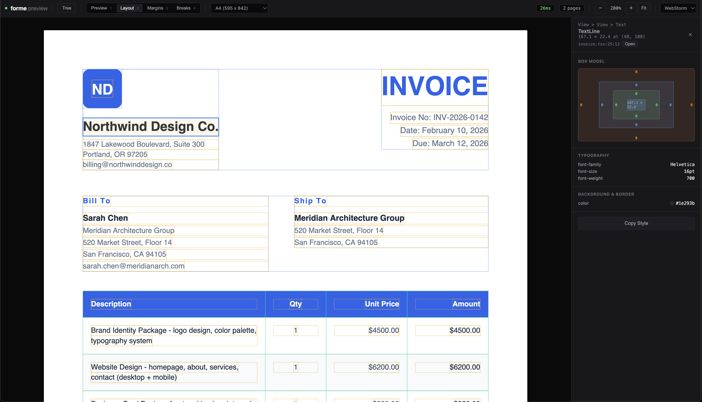

# forme

PDF generation with JSX. Page breaks that actually work.


## Why

Every PDF tool makes you choose: fight with CSS page breaks (react-pdf, Puppeteer) or use a drag-and-drop editor that can't handle dynamic data. Forme is a layout engine built for pages from the ground up. Page breaks that actually work. No headless browser. No Chrome dependency. No infinite canvas. Works in serverless environments with sub-100ms cold starts.

## Quick Start

```bash
npm install @formepdf/cli @formepdf/react @formepdf/core
```

```tsx
import { Document, Page, View, Text } from '@formepdf/react';
import { renderDocument } from '@formepdf/core';

const pdf = await renderDocument(
  <Document>
    <Page size="Letter" margin={36}>
      <Text style={{ fontSize: 24, fontWeight: 'bold' }}>Invoice #2024-001</Text>
      <View style={{ flexDirection: 'row', justifyContent: 'space-between', marginTop: 24 }}>
        <Text>Widget Pro</Text>
        <Text>$49.00</Text>
      </View>
    </Page>
  </Document>
);

// pdf is a Uint8Array: save it, serve it, email it
```

## Dev Server

```bash
npx forme dev invoice.tsx --data sample.json
```

Live preview with debug overlays. Click any element to inspect its computed styles.



## Features

- **Page-native layout**: Content flows into pages, not onto an infinite canvas. Page breaks happen at the right place, every time.
- **React components**: Document, Page, View, Text, Image, Table. If you know React, you know Forme.
- **Live preview**: `forme dev` shows your PDF updating in real time as you edit.
- **Click-to-inspect**: Select any element to see its box model, computed styles, and position.
- **Debug overlays**: Toggle bounding boxes, margins, and page break points.
- **Fast**: Rust engine compiled to WASM. Renders in milliseconds, not seconds.
- **Flex wrap + align-content**: Flex containers wrap across pages correctly. `align-content` distributes wrapped lines (`center`, `space-between`, `space-around`, `space-evenly`, `flex-end`, `stretch`).
- **Widow/orphan control**: Text paragraphs never leave a single orphan line at the bottom of a page or a single widow line at the top. Configurable via `minWidowLines` and `minOrphanLines`.
- **Table overflow**: Table cells with content taller than a page are preserved across page breaks, not silently clipped.
- **Absolute positioning**: `position: 'absolute'` with `top`, `right`, `bottom`, `left` relative to the parent View.
- **Column flex**: `justifyContent` and `alignItems` work in both row and column directions.
- **SVG**: Inline SVG rendering with support for `rect`, `circle`, `ellipse`, `line`, `polyline`, `polygon`, and `path` elements.
- **Custom fonts**: TrueType font embedding with automatic subsetting.
- **Links**: Add `href` to any `<Text>` or `<View>` for clickable PDF links.
- **Bookmarks**: Add `bookmark` to any element for PDF outline entries. Navigate long documents from the bookmark panel.
- **Inline text styling**: Nest `<Text>` inside `<Text>` to bold a word, change colors mid-sentence, or apply strikethrough.
- **Images**: JPEG and PNG with transparency support.
- **Dynamic page numbers**: `{{pageNumber}}` and `{{totalPages}}` in any text element.

## Custom Fonts

Register TrueType fonts globally or per-document:

```tsx
import { Font, Document, Text } from '@formepdf/react';
import { renderDocument } from '@formepdf/core';

// Global registration (works like react-pdf)
Font.register({
  family: 'Inter',
  src: './fonts/Inter-Regular.ttf',
});

Font.register({
  family: 'Inter',
  src: './fonts/Inter-Bold.ttf',
  fontWeight: 'bold',
});

const pdf = await renderDocument(
  <Document>
    <Text style={{ fontFamily: 'Inter', fontSize: 16 }}>
      Regular text
    </Text>
    <Text style={{ fontFamily: 'Inter', fontSize: 16, fontWeight: 'bold' }}>
      Bold text
    </Text>
  </Document>
);
```

Or pass fonts directly on the Document:

```tsx
<Document fonts={[
  { family: 'Roboto', src: './fonts/Roboto-Regular.ttf' },
  { family: 'Roboto', src: './fonts/Roboto-Italic.ttf', fontStyle: 'italic' },
]}>
```

Font sources can be file paths, data URIs, or `Uint8Array`. Fonts are automatically subsetted — only glyphs used in the document are embedded.

## Components

| Component | Description |
|-----------|-------------|
| `<Document>` | Root element. Contains pages. |
| `<Page>` | A page. Size, margins, orientation. |
| `<View>` | Container. Flexbox layout. |
| `<Text>` | Text content. Fonts, sizes, colors. |
| `<Image>` | JPEG or PNG. Aspect ratio preserved. |
| `<Table>` | Table with column definitions. |
| `<Row>` | Table row. |
| `<Cell>` | Table cell. |
| `<Svg>` | Inline SVG graphics. |
| `<Fixed>` | Repeating header or footer. |
| `<PageBreak>` | Force a page break. |

## Comparison

| | Forme | react-pdf | Puppeteer |
|---|---|---|---|
| Page breaks | Page-native (widow/orphan aware) | Broken for 7 years | CSS `page-break` (fragile) |
| Table header repetition | Automatic on every page | Not built in | Inconsistent `<thead>` |
| Live preview | Built-in dev server | Render to file | Run script, open file |
| Click-to-inspect | VS Code, Cursor, WebStorm | No | No |
| Render speed | ~10ms (WASM) | ~100-500ms | ~1-5s (Chrome boot) |
| Memory per render | ~2-5MB | ~50-100MB | ~50-200MB |
| SVG | Basic shapes and paths | Yes | Full browser SVG |
| Links | `href` prop on Text/View | `<Link>` component | HTML `<a>` tags |
| Bookmarks | `bookmark` prop on any element | Yes | No |
| Inline text styling | Nested `<Text>` elements | Nested `<Text>` elements | HTML/CSS |
| Absolute positioning | Yes | Yes | Full CSS |
| Custom fonts | TTF with subsetting | Yes | Yes |
| Dependencies | None (WASM) | yoga-layout | Chrome/Chromium |
| Runs in-process | Yes | Yes | No (subprocess) |

## Templates

See the [templates/](./templates) directory for production-ready examples:
- Invoice
- Product Catalog
- Receipt
- Report
- Shipping Label

## Documentation

Full docs at [formepdf.com/docs](https://formepdf.com/docs)

## License

MIT
