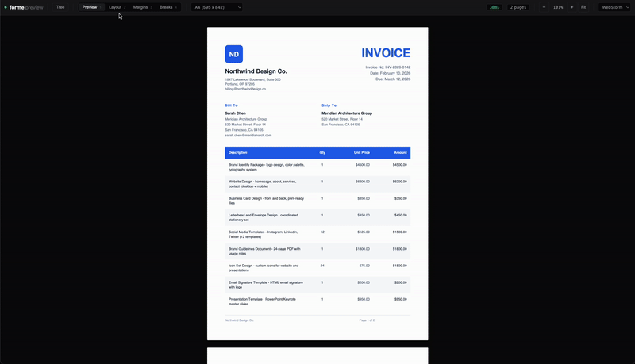

# forme

[](https://github.com/formepdf/forme/actions/workflows/ci.yml)
[](https://docs.formepdf.com/accessibility)
[](https://www.npmjs.com/package/@formepdf/core)
[](https://www.npmjs.com/package/@formepdf/core)
[](https://crates.io/crates/forme-pdf)
[](https://pypi.org/project/formepdf/)
[](https://marketplace.visualstudio.com/items?itemName=formepdf.forme-pdf)
[](https://hub.docker.com/r/formepdf/forme)
[](./LICENSE)

Forme is a document engine for JavaScript, written in Rust and compiled to WASM. Render the HTML and print CSS you already have, or author React, Svelte, Vue, and Preact components. Paginated PDFs in-process - no headless browser.



## Why

Every PDF tool makes you choose: fight with CSS page breaks or use an editor that can't handle dynamic data. Forme is a layout engine built for pages. No headless browser. No Chrome. Renders in milliseconds. Runs anywhere — Node, the browser, or at the edge.

**[Try it in the playground](https://playground.formepdf.com/)**

## Quick Start

```bash
npm install @formepdf/cli @formepdf/react @formepdf/core
```

```tsx
import { Document, Page, View, Text } from '@formepdf/react';
import { renderDocument } from '@formepdf/core';

const pdf = await renderDocument(
  <Document>
    <Page size="Letter" margin={36}>
      <Text style={{ fontSize: 24, fontWeight: 'bold' }}>Invoice #2024-001</Text>
      <View style={{ flexDirection: 'row', justifyContent: 'space-between', marginTop: 24 }}>
        <Text>Widget Pro</Text>
        <Text>$49.00</Text>
      </View>
    </Page>
  </Document>
);

// pdf is a Uint8Array: save it, serve it, email it
```

### Or use Svelte

Same components, same props, authored as `.svelte` files:

```bash
npm install @formepdf/svelte @formepdf/core
```

```svelte
<script lang="ts">
  import { Document, Page, View, Text } from '@formepdf/svelte';
</script>

<Document>
  <Page size="Letter" margin={36}>
    <Text style={{ fontSize: 24, fontWeight: 'bold' }}>Invoice #2024-001</Text>
    <View style={{ flexDirection: 'row', justifyContent: 'space-between', marginTop: 24 }}>
      <Text>Widget Pro</Text>
      <Text>$49.00</Text>
    </View>
  </Page>
</Document>
```

See the [Svelte docs](https://docs.formepdf.com/svelte) for `renderDocument`, the SvelteKit preview route helper, and endpoint patterns.

### Or use Preact

Same components, same props, authored with Preact's JSX runtime:

```bash
npm install @formepdf/preact @formepdf/core
```

```tsx
/** @jsxImportSource preact */
import { Document, Page, View, Text, renderDocument } from '@formepdf/preact';

const pdf = await renderDocument(
  <Document>
    <Page size="Letter" margin={36}>
      <Text style={{ fontSize: 24, fontWeight: 'bold' }}>Invoice #2024-001</Text>
      <View style={{ flexDirection: 'row', justifyContent: 'space-between', marginTop: 24 }}>
        <Text>Widget Pro</Text>
        <Text>$49.00</Text>
      </View>
    </Page>
  </Document>
);
```

See the [Preact docs](https://docs.formepdf.com/preact) for setup notes and edge/Workers examples.

## Dev Server

```bash
npx forme dev invoice.tsx --data sample.json
```

Live preview with debug overlays. Click any element to inspect its computed styles.

## VS Code Extension

Install [Forme PDF Preview](https://marketplace.visualstudio.com/items?itemName=formepdf.forme-pdf) from the VS Code Marketplace.

- Live PDF preview in a webview panel
- Component tree in the sidebar with hover-to-highlight
- Inspector panel with box model, computed styles, and source navigation
- Click any element on the canvas to select it in the tree and inspector

## Features

- **Page-native layout**: Content flows into pages, not onto an infinite canvas. Page breaks happen at the right place, every time.
- **React, Svelte, and Preact components**: Document, Page, View, Text, Image, Table. Author templates as JSX (`@formepdf/react`), `.svelte` files (`@formepdf/svelte`), or Preact JSX (`@formepdf/preact`) — identical props, identical output.
- **Live preview**: `forme dev` shows your PDF updating in real time as you edit.
- **Click-to-inspect**: Select any element in the browser or VS Code to see its box model, computed styles, and position.
- **Debug overlays**: Toggle bounding boxes, margins, and page break points.
- **Fast**: Rust engine compiled to WASM. Renders in milliseconds, not seconds.
- **OpenType shaping**: Real GSUB/GPOS shaping via rustybuzz. Ligatures (fi, ffi), kerning (AV), and contextual forms render correctly with custom fonts.
- **Optimal line breaking**: Knuth-Plass algorithm (the same one TeX uses) considers the entire paragraph to minimize awkward spacing. Falls back to greedy when needed.
- **Hyphenation**: Automatic hyphenation in 35+ languages. Set `hyphens: 'auto'` and a `lang` tag. Uses the hypher crate with language-specific dictionaries.
- **BiDi text**: Right-to-left text (Arabic, Hebrew) with automatic direction detection. Mixed LTR/RTL paragraphs reorder correctly. Set `direction: 'rtl'` or `direction: 'auto'`.
- **CSS Grid**: 2D grid layout with `display: 'grid'`. Fixed, fractional (`fr`), and auto track sizing. Explicit placement, auto-placement, column/row spanning, and row-level page breaks.
- **Flex wrap + align-content**: Flex containers wrap across pages correctly. `align-content` distributes wrapped lines (`center`, `space-between`, `space-around`, `space-evenly`, `flex-end`, `stretch`).
- **Widow/orphan control**: Text paragraphs never leave a single orphan line at the bottom of a page or a single widow line at the top. Configurable via `minWidowLines` and `minOrphanLines`.
- **Table overflow**: Table cells with content taller than a page are preserved across page breaks, not silently clipped.
- **Absolute positioning**: `position: 'absolute'` with `top`, `right`, `bottom`, `left` relative to the parent View.
- **Column flex**: `justifyContent` and `alignItems` work in both row and column directions.
- **SVG**: Inline SVG rendering with support for `rect`, `circle`, `ellipse`, `line`, `polyline`, `polygon`, and `path` elements. Supports `opacity`, `fill-opacity`, and `stroke-opacity`. Pass SVG as a `content` string or as JSX children.
- **QR codes**: Built-in `<QrCode>` component. Vector-based, crisp at any zoom level.
- **Barcodes**: Built-in `<Barcode>` component. Code 128, Code 39, EAN-13, EAN-8, Codabar. Vector-based.
- **Text overflow**: `textOverflow: 'ellipsis'` truncates single-line text with "..." when it exceeds available width. Also supports `'clip'`.
- **Builtin Unicode support**: Noto Sans is bundled - Cyrillic, Greek, and other non-Latin scripts work out of the box without registering fonts.
- **Font fallback chains**: `fontFamily: "Inter, Helvetica"` tries each font in order, falling back automatically.
- **Custom fonts**: TrueType font embedding with automatic subsetting.
- **Links**: Add `href` to any `<Text>`, `<View>`, `<Image>`, or `<Svg>` for clickable PDF links.
- **Bookmarks**: Add `bookmark` to any element for PDF outline entries. Navigate long documents from the bookmark panel.
- **Inline text styling**: Nest `<Text>` inside `<Text>` to bold a word, change colors mid-sentence, or apply strikethrough.
- **Images**: JPEG, PNG, and WebP with transparency support. `alt` text for accessibility.
- **CSS shorthands**: `border: "1px solid #000"`, `padding: "8 16"`, `margin: [20, 40]` — CSS-style shorthand strings and arrays parse automatically.
- **Visual style properties**: `opacity` cascades to children, `wordSpacing`, `boxShadow`, ubiquitous `borderRadius` (rounded clipping when `overflow: hidden`), and `background` accepting CSS gradient strings — `linear-gradient(135deg, #667eea, #764ba2)`, `radial-gradient(circle, #10b981, #059669)`. Multi-stop gradients supported.
- **Page backgrounds**: `<Page backgroundImage="..." backgroundSize="cover" backgroundOpacity={0.08} />` for watermark-style overlays. Sizes: `fill` / `cover` / `contain`.
- **Document language**: `<Document lang="en-US">` sets the PDF `/Lang` tag for accessibility.
- **Dynamic page numbers**: `{{pageNumber}}` and `{{totalPages}}` in any text element.
- **Embedded data**: Attach structured JSON to any PDF. Recipients can extract the original data programmatically — invoices carry their line items, reports carry their datasets.
- **Browser rendering**: Import `@formepdf/core/browser` to generate PDFs entirely client-side. Same engine, same templates — no server required.
- **Tailwind CSS**: `tw("p-4 text-lg font-bold bg-blue-500")` converts Tailwind classes to Forme style objects. Full color palette, grid, arbitrary values, negative values, fractions.
- **Fillable forms**: AcroForm components — `<TextField>`, `<Checkbox>`, `<Dropdown>`, `<RadioButton>`. Fill and flatten for non-editable delivery.
- **PDF/UA accessibility**: `<Document pdfUa>` generates PDF/UA-1 conforming documents — structure tree with tagged headings, lists (`/LBody`), tables (`/TH` scope, `/ColSpan`), links (`/Link` + `OBJR`), figure `/Alt`, tab order, and artifact tagging. See [Compliance](#compliance).
- **PDF/A archival**: `<Document pdfa="2b">` for long-term preservation — PDF/A-2b, 2u, and 2a, veraPDF-verified, and composable with `pdfUa` (archival + accessible at once). See [Compliance](#compliance).
- **Digital certification**: PKCS#7 certification with X.509 certificates via the `certification` prop or `/v1/certify` API endpoint.
- **PDF redaction**: True content removal with metadata scrubbing. Text-search, regex, presets, and saved templates.
- **PDF merging**: Combine 2-20 PDFs into one via `/v1/merge`.
- **PDF rasterization**: Convert pages to PNG images via `/v1/rasterize`, powered by PDFium.

## Compliance

**PDF/UA-1 (accessibility) — verified.** A nine-document corpus — the five
shipped [`@formepdf/templates`](#templates) (invoice, receipt, report,
shipping-label, letter) and four HTML fixtures (letterhead, dashed-borders,
statement, zebra-invoice) — passes [veraPDF](https://verapdf.org) 1.30.2 against
the PDF/UA-1 profile: **9/9**. The check runs in CI on every push
(`scripts/verify-pdfua.mjs`), so the claim can't silently rot.

- **Tagging is on by default.** Every render emits a structure tree; pass
  `tagged={false}` to opt out. Tagging is layout-neutral — the tag tree is built
  after layout, so geometry and visual output are byte-for-byte identical.
- **PDF/UA needs three things from you.** Set `pdfUa`, give the document a
  `lang`, and register a metric-compatible font so the base-14 families embed —
  install [`@formepdf/fonts-standard`](./packages/fonts-standard) and pass
  `standardFonts()` to `fonts`. It's a separate, optional package: core carries
  no font payload, so users who don't need conformance don't pay for it.
- **Nothing fails silently.** If `pdfUa` is set but no embeddable font is
  registered, the render still succeeds and names the gap in `warnings` (surfaced
  through `renderPdfWithLayout` and the HTML wrapper) rather than emitting a PDF
  that falsely claims conformance.

```tsx
import { standardFonts } from '@formepdf/fonts-standard';

<Document pdfUa lang="en-US" fonts={standardFonts()}>
  {/* … */}
</Document>
```

**PDF/A (archival) — verified.** `<Document pdfa="2b">`, `"2u"`, and `"2a"` produce
PDF/A-2 conforming files, verified by the same veraPDF gate: the nine-document
corpus passes **PDF/A-2b and PDF/A-2a**. The font path uses the same
metric-compatible embedding as PDF/UA (with a per-glyph width carve-out for the
few glyphs where Liberation's advances diverge from the base-14 AFM metrics), an
embedded sRGB OutputIntent, and PDF/A XMP metadata.

**Archival *and* accessible.** PDF/A composes with PDF/UA — set both and the file
is conformant to each at once:

```tsx
<Document pdfa="2a" pdfUa lang="en-US" fonts={standardFonts()}>…</Document>
```

The CI gate validates every corpus file against PDF/A-2b, PDF/A-2a, **and**
PDF/UA-1 together (`scripts/verify-pdfa.mjs`). The HTML path takes the same via
`pdfA` (`renderHtml`) / `--pdf-a` (CLI). Needs an embeddable font
([`@formepdf/fonts-standard`](./packages/fonts-standard)) — if none is
registered, the render fails by name rather than emitting a file that falsely
claims conformance. See [Archival](https://docs.formepdf.com/archival).

## Browser Usage

Generate PDFs in the browser with zero server dependencies:

```tsx
import { renderDocument } from '@formepdf/core/browser';
import { Document, Page, Text } from '@formepdf/react';

const pdfBytes = await renderDocument(
  <Document>
    <Page size="Letter" margin={36}>
      <Text style={{ fontSize: 24 }}>Generated in the browser</Text>
    </Page>
  </Document>
);

// Download, display in an iframe, or upload
const blob = new Blob([pdfBytes], { type: 'application/pdf' });
const url = URL.createObjectURL(blob);
window.open(url);
```

Works with Vite, Next.js, Remix, or any bundler that handles WASM. The only difference from server-side usage is the import path.

## Custom Fonts

Register TrueType fonts globally or per-document:

```tsx
import { Font, Document, Text } from '@formepdf/react';
import { renderDocument } from '@formepdf/core';

// Global registration (works like react-pdf)
Font.register({
  family: 'Inter',
  src: './fonts/Inter-Regular.ttf',
});

Font.register({
  family: 'Inter',
  src: './fonts/Inter-Bold.ttf',
  fontWeight: 'bold',
});

const pdf = await renderDocument(
  <Document>
    <Text style={{ fontFamily: 'Inter', fontSize: 16 }}>
      Regular text
    </Text>
    <Text style={{ fontFamily: 'Inter', fontSize: 16, fontWeight: 'bold' }}>
      Bold text
    </Text>
  </Document>
);
```

Or pass fonts directly on the Document:

```tsx
<Document fonts={[
  { family: 'Roboto', src: './fonts/Roboto-Regular.ttf' },
  { family: 'Roboto', src: './fonts/Roboto-Italic.ttf', fontStyle: 'italic' },
]}>
```

Font sources can be file paths, data URIs, or `Uint8Array`. Fonts are automatically subsetted — only glyphs used in the document are embedded.

## Components

| Component | Description |
|-----------|-------------|
| `<Document>` | Root element. `title`, `author`, `lang`, `fonts`, `style`. |
| `<Page>` | A page. `size`, `margin` (number, string, array, or edges). |
| `<View>` | Container. Flexbox layout. `href`, `bookmark`. |
| `<Text>` | Text content. Fonts, sizes, colors. `href`, `bookmark`. |
| `<Image>` | JPEG or PNG. `href`, `alt`. Aspect ratio preserved. |
| `<Table>` | Table with column definitions. |
| `<Row>` | Table row. `header` for repeating on page breaks. |
| `<Cell>` | Table cell. `colSpan`, `rowSpan`. |
| `<Svg>` | Inline SVG graphics. `content` string or JSX children. `href`, `alt`. |
| `<QrCode>` | QR code. `data`, `size`, `color`. Vector-based. |
| `<Barcode>` | 1D barcode. `data`, `format`, `width`, `height`, `color`. Code 128, Code 39, EAN-13, EAN-8, Codabar. |
| `<Canvas>` | Arbitrary vector drawing via `draw` callback. |
| `<BarChart>` | Bar chart. `data`, `color`, `showGrid`, `showValues`, `title`. |
| `<LineChart>` | Multi-series line chart. `series`, `labels`, `showPoints`, `showGrid`, `title`. |
| `<PieChart>` | Pie/donut chart. `data`, `donut`, `showLegend`, `title`. |
| `<AreaChart>` | Multi-series area chart. `series`, `labels`, `showGrid`, `title`. |
| `<DotPlot>` | Scatter plot. `groups`, `xLabel`, `yLabel`, `showLegend`, `dotSize`. |
| `<Watermark>` | Rotated text behind page content. `text`, `fontSize`, `color`, `angle`. |
| `<TextField>` | Form text input. `name`, `value`, `width`, `multiline`, `password`, `readOnly`. |
| `<Checkbox>` | Form checkbox. `name`, `checked`. |
| `<Dropdown>` | Form select dropdown. `name`, `options`, `value`, `width`. |
| `<RadioButton>` | Form radio button. `name`, `value`, `checked`. |
| `<Fixed>` | Repeating header or footer. |
| `<PageBreak>` | Force a page break. |

## Comparison

| | Forme | react-pdf | Puppeteer |
|---|---|---|---|
| Page breaks | Page-native layout (widows/orphans) | Widows/orphans (recent rewrite) | CSS `page-break` (fragile) |
| Table header repetition | Automatic on every page | Not built in | Inconsistent `<thead>` |
| Line breaking | Knuth-Plass | Knuth-Plass | Browser engine |
| Hyphenation | Automatic, 35+ languages bundled | Automatic (en-US bundled) | Browser engine |
| Text shaping | OpenType GSUB/GPOS (rustybuzz) | OpenType GSUB/GPOS (fontkit) | Full browser shaping |
| BiDi text | RTL, mixed LTR/RTL (unicode-bidi) | RTL, mixed LTR/RTL (bidi-js) | Full browser BiDi |
| CSS Grid | `display: 'grid'` with fr/auto/fixed tracks | No | Full CSS Grid |
| Live preview | Built-in dev server | Render to file | Run script, open file |
| Click-to-inspect | VS Code, Cursor, WebStorm | No | No |
| Render speed | ~28ms (4-page report) | ~100-500ms | ~1-5s (Chrome boot) |
| Memory per render | No browser process (WASM) | ~50-100MB | ~50-200MB |
| SVG | Basic shapes and paths | Yes | Full browser SVG |
| Links | `href` prop on Text/View/Image/Svg | `<Link>` component | HTML `<a>` tags |
| Bookmarks | `bookmark` prop on any element | Yes | No |
| QR codes | Built-in `<QrCode>` component | No | Via HTML/JS libraries |
| Barcodes | Built-in `<Barcode>` (5 formats) | No | Via HTML/JS libraries |
| Charts | Engine-native BarChart, LineChart, PieChart, AreaChart, DotPlot | No | Via HTML/JS libraries |
| VS Code extension | Native sidebar panels | No | No |
| Canvas drawing | `<Canvas draw={...}>` for custom vector graphics | `<Canvas>` primitive | HTML Canvas (raster) |
| Watermarks | Built-in `<Watermark>` component | No | Manual positioning |
| Embedded data | Attach JSON to PDF, extract later | No | No |
| Text overflow | `textOverflow: 'ellipsis'` | `textOverflow` + `maxLines` | CSS `text-overflow` |
| Font fallback | `fontFamily` array + per-glyph fallback | `fontFamily` array | Full CSS font stack |
| Custom fonts | TTF with OpenType shaping | Yes | Yes |
| Browser rendering | Yes (`@formepdf/core/browser`) | Yes (client-side) | No (server only) |
| Tailwind CSS | `tw("p-4 text-lg font-bold")` utility | No | No |
| Fillable forms | AcroForm (TextField, Checkbox, Dropdown, Radio) | AcroForm primitives (TextInput, Select, Checkbox, FieldSet) | HTML `<form>` (not PDF forms) |
| PDF/UA accessibility | `<Document pdfUa>` | No | No |
| PDF/A archival | `<Document pdfa="2b">` | No | No |
| Digital certification | PKCS#7 via `certification` prop or API | No | No |
| Redaction | True content removal + metadata scrubbing | No | No |
| PDF merging | Combine multiple PDFs | No | No |
| Rasterization | PDF → PNG via PDFium | No | No |
| Dependencies | None (WASM) | yoga-layout | Chrome/Chromium |
| Runs in-process | Yes | Yes | No (subprocess) |

## Templates

See the [templates/](./templates) directory for production-ready examples:
- Invoice
- Product Catalog
- Receipt
- Report
- Shipping Label
- Typography
- Grid Dashboard
- Charts Showcase
- Event Ticket

## Tailwind CSS

Style Forme components with Tailwind utility classes via `@formepdf/tailwind`:

```bash
npm install @formepdf/tailwind
```

```tsx
import { tw } from '@formepdf/tailwind';

<View style={tw("flex-row items-center gap-4 p-6 bg-slate-100 rounded-lg")}>
  <Text style={tw("text-2xl font-bold text-slate-900")}>Invoice</Text>
  <Text style={tw("text-sm text-slate-500")}>Draft</Text>
</View>
```

Supports spacing, typography, colors (full Tailwind palette), flexbox, grid, borders, opacity, arbitrary values (`w-[200]`, `bg-[#f00]`), negative values (`-mt-4`), fraction widths (`w-1/2`), and `self-*` alignment.

## Documentation

Full docs at [docs.formepdf.com](https://docs.formepdf.com):
- [Forms](https://docs.formepdf.com/forms) — fillable AcroForm components
- [Accessibility](https://docs.formepdf.com/accessibility) — PDF/UA-1 compliance
- [Archival](https://docs.formepdf.com/archival) — PDF/A compliance
- [Digital Certification](https://docs.formepdf.com/concepts/digital-certification) — PKCS#7 certification

## Contributing

Issues and PRs welcome.

## License

MIT
